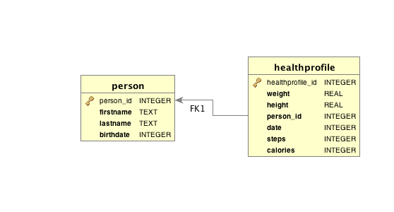

assignment3
===========

Database:
----------------
The database used is Sqlite, and Hibernate in order to map Relational Entities on Java Object.

The following picture show an E/R schema of the database used.

Usage:
----------------