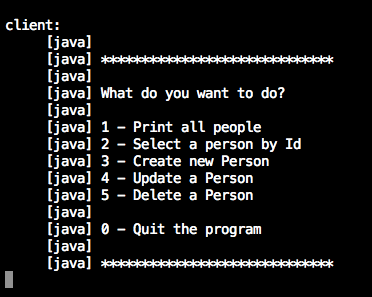
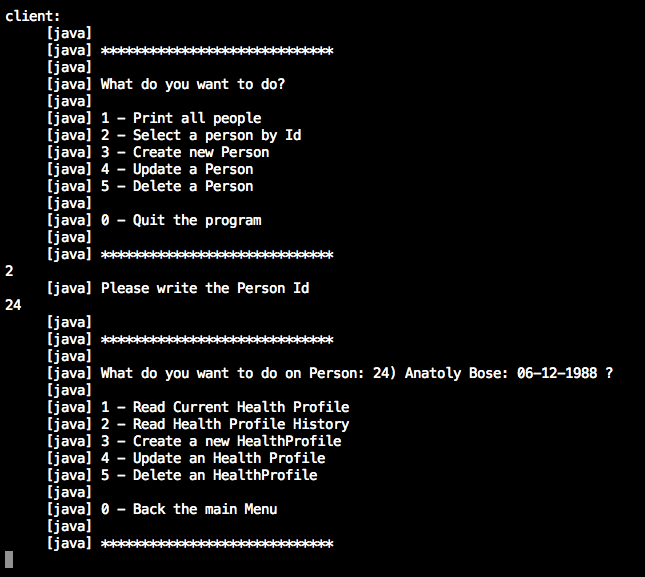

Assignment3 - Lorenzo Rigato
===========

All code is available @ [my github repository](https://github.com/llollox/assignment3)

Database
----------------
The database used is Sqlite, and Hibernate in order to map Relational Entities on Java Object.

The following picture show an E/R schema of the database used.

Usage
----------------
First of all run `run compile` to compile and get all the dependencies using Ivy

Then run `ant server` run the Soap Server. 

Finally, in another console, run `ant client` to run the Client. 

Then you will see the Main Menu, here you can select the CRUD operation for the people.

By selecting a person (option 2) and providing a person Id you will see the Personal Menu for the selected
person and here you can select the CRUD operation for the Health Profiles of that person.

Enjoy! :-)

Dependencies
-----------
Dependencies are managed with Ivy tool.

The only thing that you have to do to use Ivy is copy ivy-2.3.0.jar file into your ANT_DIRECTORY/lib and that's all.

You can find that file in the root directory of the project.

In Ivy.xml you can find the list of dependencies that we need to run the project.

Every time the project is compiled Ivy check that file to download all dependencies needed.

